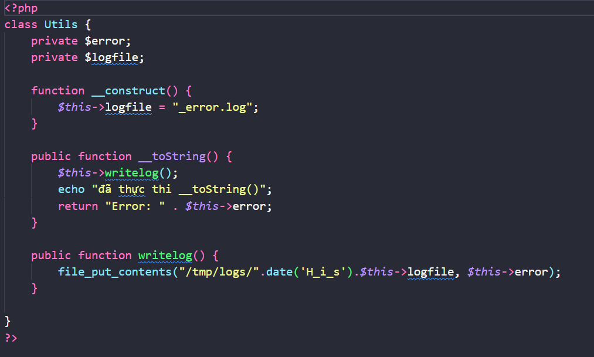
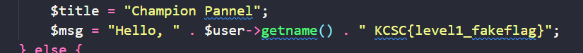
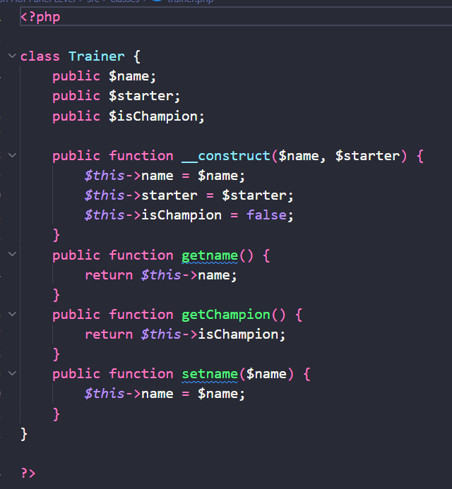
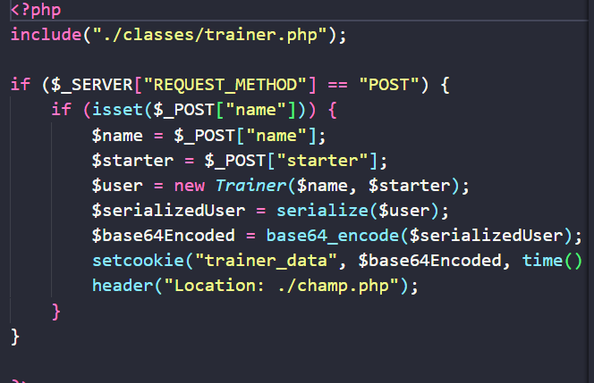
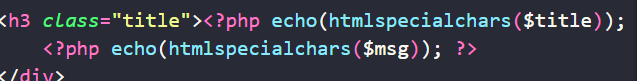

xin chào các bạn lại thêm 1 bài nữa sau khi kết thúc đợt tuyển mình đã học được thêm dạng này trên portswigger:<

Bài này là dạng white-box src file là php dạng deseria vul nha

src của file untils:  

Như đánh giá thì bạn thấy được file này có class Untils
khởi tạo 2 giá trị private là $error và $logfile
ban đầu thì gán $this->logfile = "_error.log";

Trong này có hàm magic của hay gặp trong unserial là 
__toString() sẽ gọi phương thức writelog
hàm này sẽ chạy khi mà có một đối tượng nào đó biến thành string và cụ thể là ở trong file index.php

+file writelog() sẽ thêm nội dung của $this->error vào file "/tmp/logs/".date('H_i_s').$this->logfile"

có vẻ như là vấn đề đã ở đây ở đây 
lướt qua file trainer.php

hàm này sẽ khởi tạo các giá trị và các phương thức để lấy giá trị xuất ra từ cookie thông qua xử lý

file index.php 

khi thực hiện method POST từ form sẽ tạo một đối tượng
   $user = new Trainer($name, $starter);
mình sẽ khai thác ở đây vì đây là giá trị mình có thể kiểm soát được

trong file cham.php chú ú một đoạn đã nhắc ở trên và

có tác dụng sẽ khi nội dung vào file log

đầu tiên thì khi đổi giá trị isChampion thành 1
thì ta đươc fake-flag

~ chưa xong ạ:<