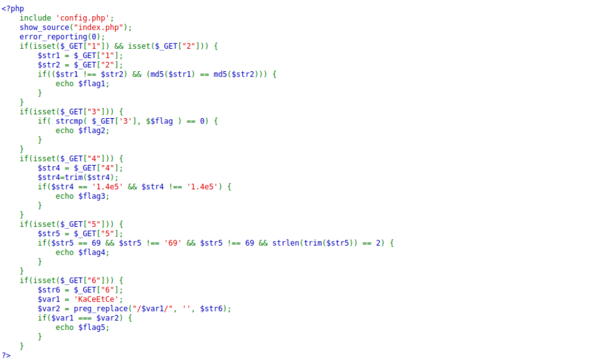
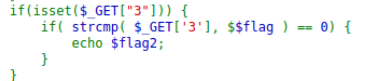
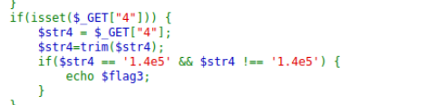

xin chào các bạn đã trở lại với series của mình

Phần 1 ta có đoạn code

Để lấy được flag1 thì str1 !== str2 và md5 của 5 chuỗi này giống nhau
Hướng giải quyết là nhập vào 1 mảng str1 và mảng str2

vì  hàm md5 của một mảng sẽ trả ra lôĩ và md5(str1) sẽ bằng md5(str2)

và nếu nhập $str1=1 và $str2=0 khác nhau và 3 2 1 pùm
                                        url?str1[]=0&&str2[]=1

Phần 2 ta có đoạn code như sau:

Như ta thấy thì khi mà hàm strcmp trả về 0 thì sẽ hiện flag
Tương tự nếu hàm này truyền vào một mảng thì sx trả về NULL mà NULL ==0 NÊn 3 2 1 pùm

Phần 3 ta có đoạn code như sau:

Như ta thấy thì khi truyền vào sẽ trim(input) là sẽ xóa hết ký tự khoảng trắng
Yêu cầu là $srt3 == '1.4e5' && $str3 !== '1.4e5' ta sẽ truyền 01.4e5