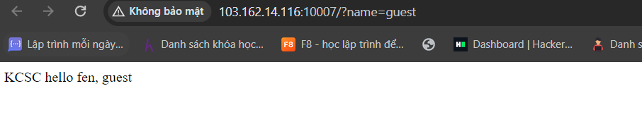
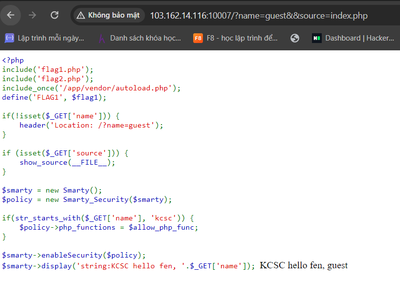
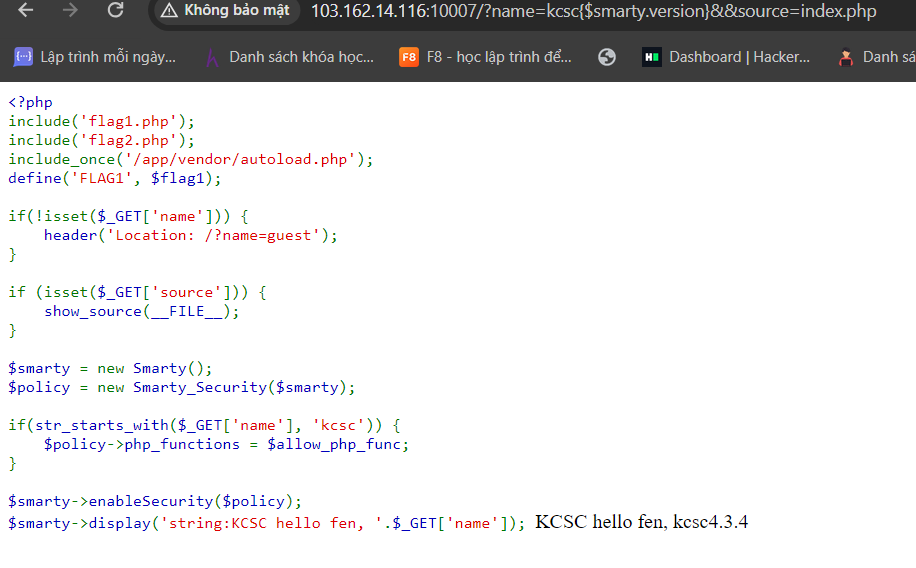
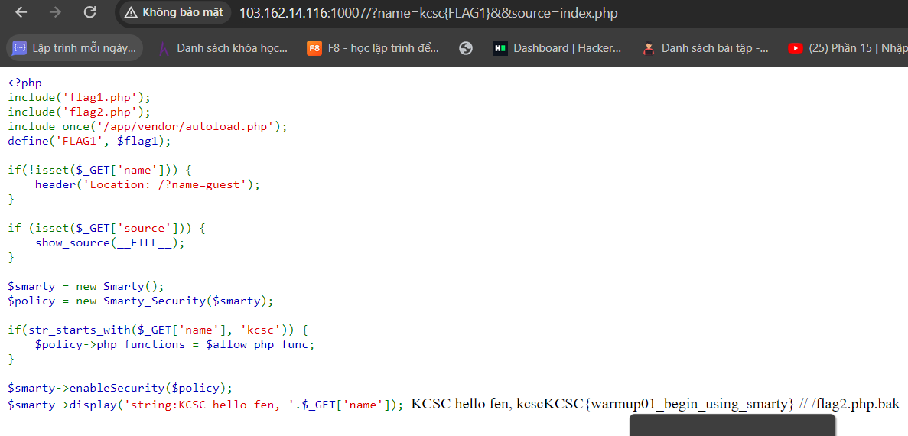

bài này có 3 chall luôn easy medium và hard

chall đầu tiên

bình thường khi GET 1 cái khác đều redirect về /user=?
vào trong này thì mình thầy như này và như một cái gì đó mình nghĩ nó là ssti bạn thử root-force

thì ra nhiều file như /robots.txt /composer.json và /composer.lock

search ra thì nó là config của templates-engine Smarty của php
vào trong /robots.txt  mình thấy có 1 parameter là /?sources
thì mình thử GET /?sources=index.php

thì mình nhận được cái source như này

Nhìn sơ qua thì file này include vào flag1.php và flag2.php còn app/vendor/autoload.php là một lib
sau đó thì có gán hằng FLAG bằng giá trị của flag1
nếu mà không có name thì redirect về /?name=guest
+nếu get["sources"] thì sẽ trả ra source của file hiện tại
+khai báo smarty và check nếu name bắt đầu bằng kcsc thì sẽ áp dụng 1 loại cho phép nào đó cho template này
+ Sau đó display name
#đầu tiên mình thử các loại payload trong list ssti của smarty thì được {$smarty.version} và {7*7} {7*7}

version là 4.3.4 đầu tiên thì mình thử dùng system rồi exec các kiểu mà không được sau đó còn check CVE cơ:v thì ra
là lấy giá trị FLAG1 đã khai báo và gán ở trên <ban đầu mình dùng {$FLAG1} cơ nên hãy đọc doc trước nhá hihi>
và 3 2 1 pùm 
