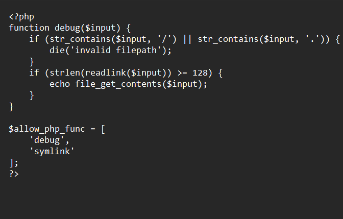

xin chào các bạn:< bài này sau giải mình mới làm được sau một đêm mò mẫn ở portswigger
Bài này là nối tiếp với các bài trước nha hint từ bài trước là //flag2.php.bak

đầu tiên mình sẽ get route
                                        /?source=flag2.php.bak
Thì như src trước nếu mà name bạn bắt đầu bằng kcsc thì sẽ allow_function trong file flag2.php như này
ban đầu theo tự duy là mình sẽ dùng symlink để gắn link symbolic cho file này nên mình định như này /?

name=kcsc{symlink("/var/www/app/../../www/app/../../www/app/../../www/app/../../www/app/../../www/app/../../www/app/../../www/app/../../www/app/../../www/app/../../www/app/../../www/app/../../www/app/../../www/app/../../www/app/../../www/app/flag2.php","hihihi")}{debug("hihi")} mà không được sau khi đọc docs và tham khảo thêm :< thì mình sẽ gắn symlink mình đã dựng lại trên server khác dùng file Smarty mình kiếm được trên routes /composer.json và .lock(các bạn có thể tìm bản 4.3.4 trên github cũng được nha)

Cú pháp khai báo biến trong smarty(php)
                                        {assign var=ten_bien value="Gia_tri_cua_bien"}
Yêu cầu của hàm debug : $imput không chứa kí tự ".", và "/" và độ dài khi readlink($input)>=128
và sau đó mình đã thử lại thì như sau
                                        /?name=kcsc{assign var="a" value="flag2.php"}{assign var="b" value="hihihihihiihihhhhhhhhhhhhhhhhhhhhhhhhhhhhhhhhhhhhhhhhhhhhhhhhhhhhhhhhhhhhhhhhhhhhhhhhhhhhhhhhhhhhhhhhhhhhhhhhhhhhhhhhhhh"}{assign var="z" value="hihi"}{symlink($x,$y){symlink($y,$z)}{debug("hihi")}
sau đó mở sources:trang web lên và lấy flag trong cmt nhá ^^

giải thích một chút về hàm symlink: nó sẽ trỏ đến vị trí của một file khác kiểu như linkruts gọn ấy:v thì khi tạo xong sẽ có tên file đó màu xanh ở trong file đích
còn cơ chế trên là :
sẽ gắn link cho file flag2.php là "hihihiihihihhhhhhhhhhhhhhhhhhhhhhhhhhhhhhhhhh" sau đó gắn link của hihi là "hihihihiiiiiiiiiiiihhhhhhh" thì theo quy tắc bắc cầu thì hihi sẽ trỏ đến flag2.php

Khi mà check đầu tiên ấy : thì check $input=hihi để không dính "invalid partten"

Check thứ 2 : realink sẽ lấy symbolink của $input là hihhihihhiihih"128 kí tự trở lên nha không thì không chạy được show_file_contents";

cảm ơn đã theo dõi^^

