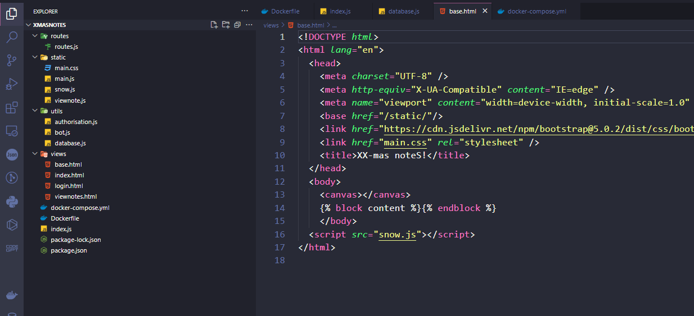
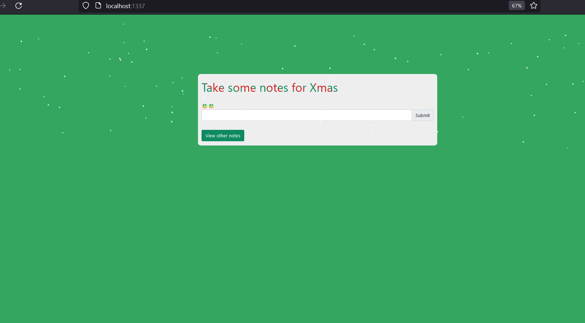
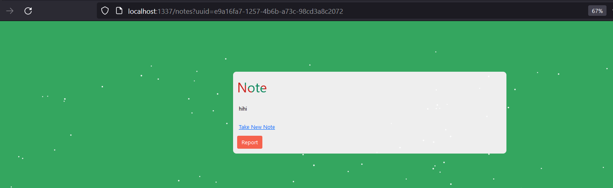
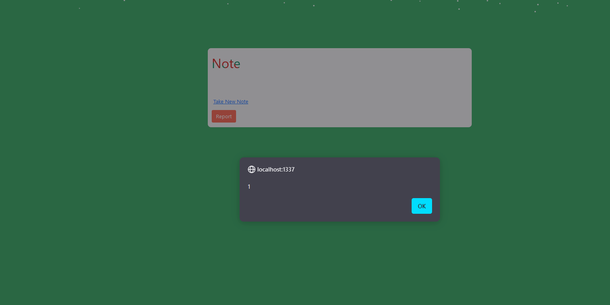
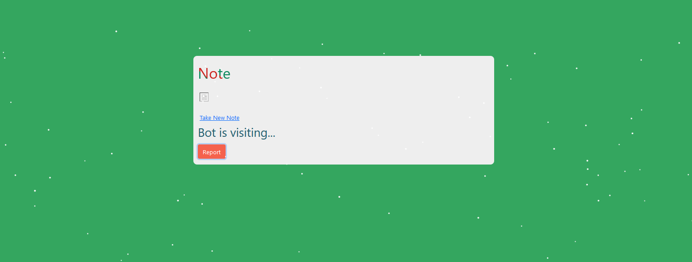
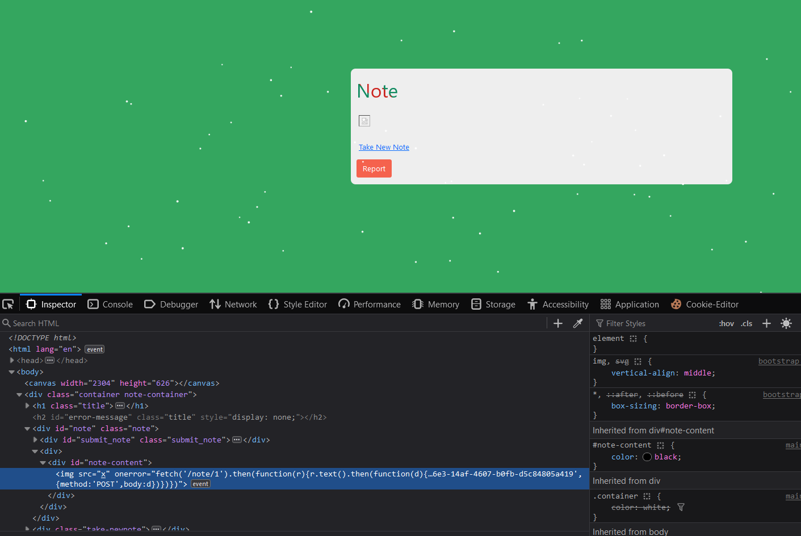
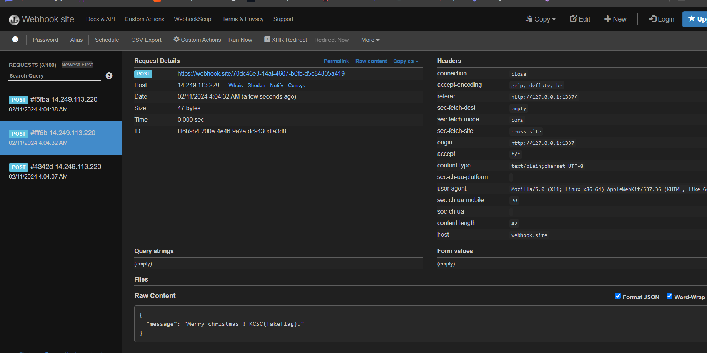

- Về cấu trúc thư mục của challenge này như thế này ạ

- Chức năng chung của ứng dụng là viết notes và xem note của mình vừa mới tạo ạ.

- vì trước em chưa làm chall này cho nên em build docker lại để test ạ.

- Khi em vào thì giao diện trang chính như này 

- Khi mà em viết note sau submit thì sẽ thực hiện fetch api với hàm này

submitNote.addEventListener('click', (event) => {

    typeMessage('Saving your note...');

    fetch('/submit', {
            method: 'POST',
            body: JSON.stringify({
                message: input.value,
            }),
            headers: {
                'Content-Type': 'application/json',
            },
        })
        .catch(error => {
            typeMessage(error);
        })
        .then(response => response.json()
            .then(data => {
                if (response.status !== 201) {
                    typeMessage(data.message);
                } else {
                    setTimeout(() => {
                        window.location = '/notes?uuid=' + data.message;
                    }, 2000);
                }
            }));
});

- Và chuyển đến xem note của em vừa tạo

- ở trang này thì sẽ thực hiện load note hiện tại của em và hiển thị như trên
const loadNote = () => {
  fetch(`/note/${currentNote}`)
    .then(response => response.json())
    .then(data => {

      if (data.error) {
        note.style.display = 'none';
        errorMessage.style.display = '';
        errorMessage.textContent = data.error;
        return;
      }

      note.style.display = '';
      errorMessage.style.display = 'none';
      noteText.innerHTML = data.message;
    });
};

loadNote();

## App sử dụng sqlite để thực hiện lưu trữ thông tin

const sqlite = require("sqlite-async");

## Phân tích

class Database {
    constructor(db_file) {
        this.db_file = db_file;
        this.db = undefined;
    }

    async connect() {
        this.db = await sqlite.open(this.db_file);
    }

    async migrate() {
        return this.db.exec(`
            DROP TABLE IF EXISTS notes;

            CREATE TABLE IF NOT EXISTS notes (
                uuid      VARCHAR(300) NOT NULL,
                message   VARCHAR(300) NOT NULL,
                hidden    INTEGER NOT NULL
            );

            INSERT INTO notes (uuid, message, hidden) VALUES
                ("1", "Merry christmas ! KCSC{fakeflag}.", 1)
            `);
    }

    async getNote(uuid) {
        return new Promise(async(resolve, reject) => {
            try {
                let stmt = await this.db.prepare("SELECT * FROM notes WHERE uuid = ?");
                resolve(await stmt.get(uuid));
            } catch (e) {
                reject(e);
            }
        });
    }

    async insertNote(message, uuid) {
        return new Promise(async(resolve, reject) => {
            try {
                let stmt = await this.db.prepare("INSERT INTO notes (uuid, message, hidden) VALUES (?, ?, ?)");
                await stmt.run(uuid, message, false);
                resolve(uuid);
            } catch (e) {
                reject(e);
            }
        });
    }
}

module.exports = Database;

chú ý 2 routes này:
   async getNote(uuid) {
        return new Promise(async(resolve, reject) => {
            try {
                let stmt = await this.db.prepare("SELECT * FROM notes WHERE uuid = ?");
                resolve(await stmt.get(uuid));
            } catch (e) {
                reject(e);
            }
        });
    }

    async insertNote(message, uuid) {
        return new Promise(async(resolve, reject) => {
            try {
                let stmt = await this.db.prepare("INSERT INTO notes (uuid, message, hidden) VALUES (?, ?, ?)");
                await stmt.run(uuid, message, false);
                resolve(uuid);
            } catch (e) {
                reject(e);
            }
        });
    }

- Chức năng report to bot:
const reportToBot = () => {
  typeMessage('Bot is visiting...');
  fetch(`/visit/${currentNote}`)
    .then(response => response.json())
    .then(data => {
      if (data.error) {
        alert(data.error)
        return;
      }
      alert(data.message)
      location.reload();
    });
};
- Sẽ gọi đến api:
const puppeteer = require('puppeteer');

const browser_options = {
    headless: true,
    args: [
        '--no-sandbox',
        '--disable-background-networking',
        '--disable-default-apps',
        '--disable-extensions',
        '--disable-gpu',
        '--disable-sync',
        '--disable-translate',
        '--hide-scrollbars',
        '--metrics-recording-only',
        '--mute-audio',
        '--no-first-run',
        '--safebrowsing-disable-auto-update',
        '--js-flags=--noexpose_wasm,--jitless'
    ],
};

const visit = async(url, authenSecret) => {
    try {
        const browser = await puppeteer.launch(browser_options);
        let context = await browser.createIncognitoBrowserContext();
        let page = await context.newPage();

        await page.setCookie({
            name: 'auth',
            value: authenSecret,
            domain: '127.0.0.1',
            httpOnly: true, // stay away from my cookie
        });

        await page.goto(url, {
            waitUntil: 'networkidle2',
            timeout: 5000,
        });
        await page.waitForTimeout(3000);
        await browser.close();
    } catch (e) {
        console.log(e);
    }
};

module.exports = visit;

Thư viện puppeteer có tác dụng:
- Truy cập vào trang web: Puppeteer được sử dụng để mở một trình duyệt ẩn danh và truy cập vào một URL được chỉ định. Trong trường hợp này, URL được truy cập là /visit/${currentNote}.

- Tương tác với trang web: Sau khi trang web được tải, Puppeteer có thể thực hiện các hành động như click vào nút, điền vào biểu mẫu, hoặc thậm chí thực hiện các hành động phức tạp hơn như cuộn trang hoặc thao tác với các phần tử trên trang.

- Xử lý kết quả: Sau khi thực hiện hành động trên trang web, Puppeteer có thể trích xuất thông tin từ trang hoặc xử lý kết quả như thông báo thành công hoặc lỗi.

- Chức năng này sẽ check xem bạn có phải admin không

+ Mấu chốt ở đây là XSS ở file viewnote.js
  noteText.innerHTML = data.message;
  - Việc sử dụng hàm này khiến cho chúng ta có thể XSS được và hướng khai thác là dùng XSS
  - Luồng ở đây là em sẽ tạo XSS vào trang viewnote của em
  - Quan sát em thấy Flag lưu tro g database với uuid là 1 và getNote cần phải là admin mới có thể thực hiện được
     INSERT INTO notes (uuid, message, hidden) VALUES
                ("1", "Merry christmas ! KCSC{fakeflag}.", 1)
  - Em sẽ dùng payload
                  
  -  Tận dụng XSS em sẽ dùng một promise để fetch get note uuid là 1 vì khi report cho bot có quyền như amin cho nên có thể fetch được sau đó sẽ gửi kết quả tới webhook của em.

## Tấn công
- Đầu tiên em thử test XSS với payload
                  

- Và quả thực thành công

- Em sẽ sử dụng payload:

- sau khi em report trang này cho bot thì bot sẽ đọc
 
- Và em XSS được

- Flag em nhận được là:

