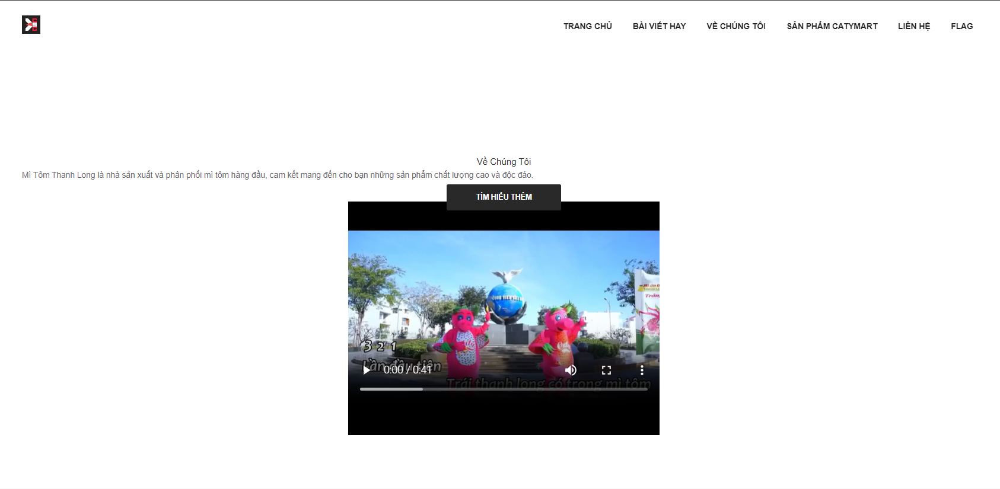
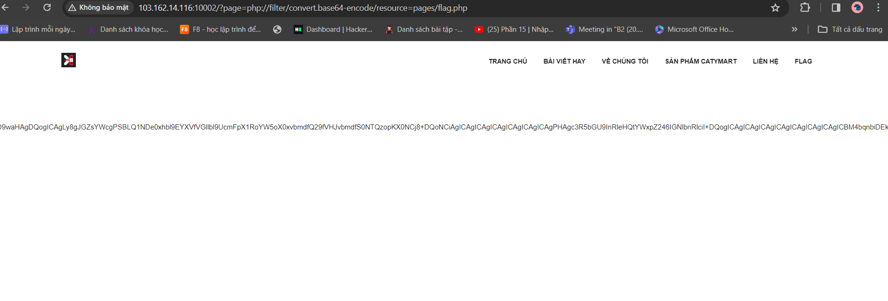

bài này là LFI á:<

vào giao diện sẽ như này 

thì có 1 routes FLAG như kia mình có ấn qua thử nhưng không có gì 
vìa thấy url có parameter và page nên mình đoán nó là file includetion

thử với param 

                                        ?page=php://filter/convert.base64-encode/resource=pages/flag.php

Lấy chuỗi ra decode base64 thì được flag:<